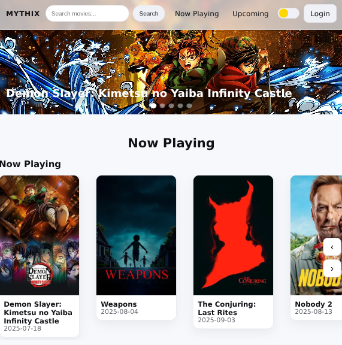
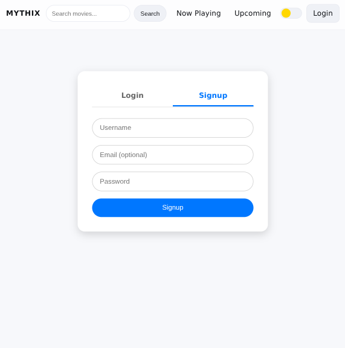

# 🎬 Movie Booking App

A full-stack movie booking platform built with **Django REST Framework**, **React.js**, and **MySQL**.  
This project was created after learning Django, React, and MySQL.

---

## ✨ Features

### Core Features
- 🔑 **Authentication**
  - JWT login & signup
- 🎥 **Movie Discovery**
  - Browse movies from TMDB API
  - Search and view movie details
- 🎟 **Booking System**
  - Theater & showtime selection
  - Booking confirmation and history

### Planned Features (Future Enhancements)
- CI/CD pipeline for deployment  
- Real-time seat booking (WebSockets)  
- Redis caching integration  

---

## 🛠 Tech Stack

- **Backend**: Django REST Framework, MySQL, JWT  
- **Frontend**: React 18, Vite  
- **External APIs**: TMDB (movie data)  

---

## 📸 Screenshots

> Add actual images from your project. Example:
>
>   
>   

---

## 🚀 Getting Started

### Prerequisites
- Python 3.9+  
- Node.js 18+  
- MySQL 8.0  

### Clone Repository
```bash
git clone https://github.com/yourusername/movie-booking-app.git
cd movie-booking-app

cd server
python -m venv venv
source venv/bin/activate   # On Windows: venv\Scripts\activate
pip install -r requirements.txt

# Migrations
python manage.py makemigrations
python manage.py migrate

# Create admin user
python manage.py createsuperuser

# Start Django server
python manage.py runserver


cd ../client
npm install
cp .env.example .env   # Add API URL + TMDB keys
npm run dev
